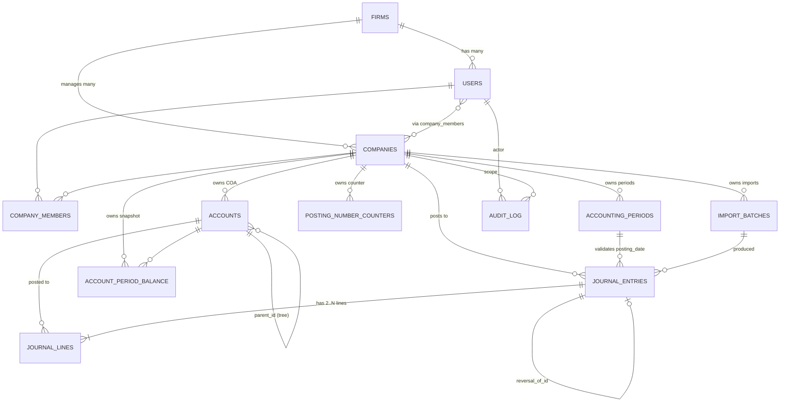
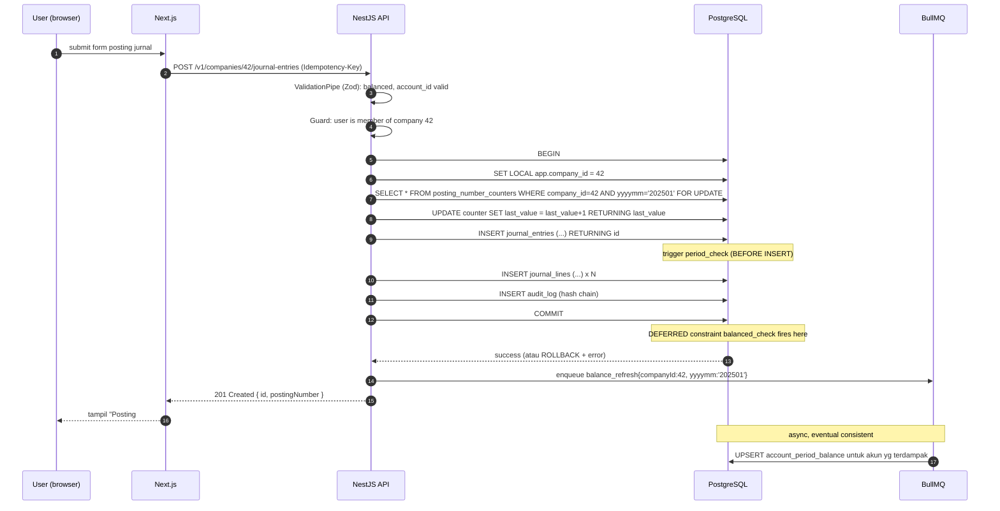
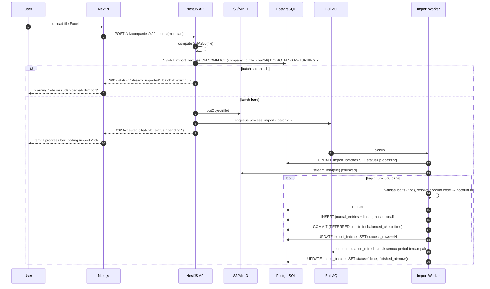
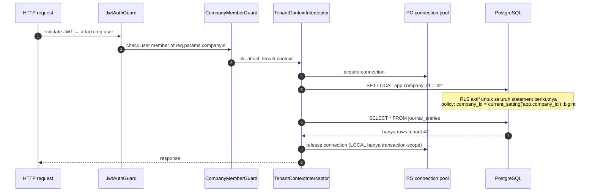
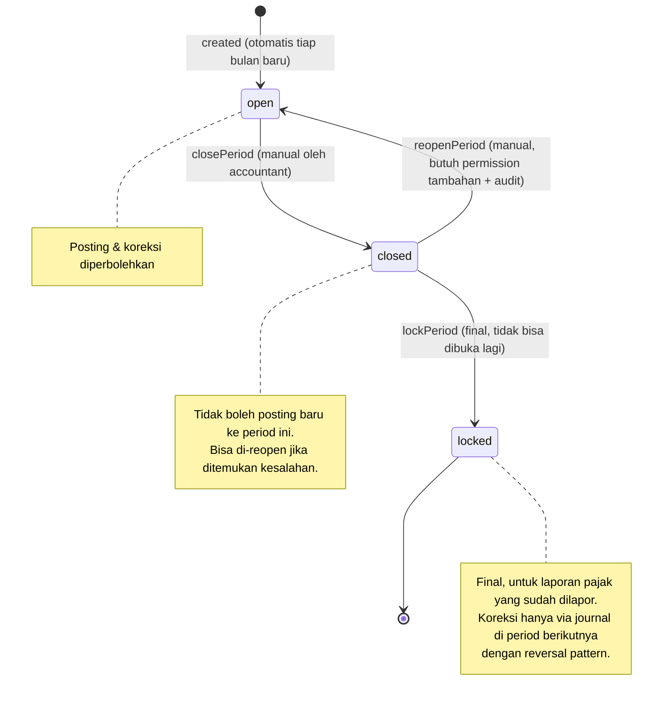
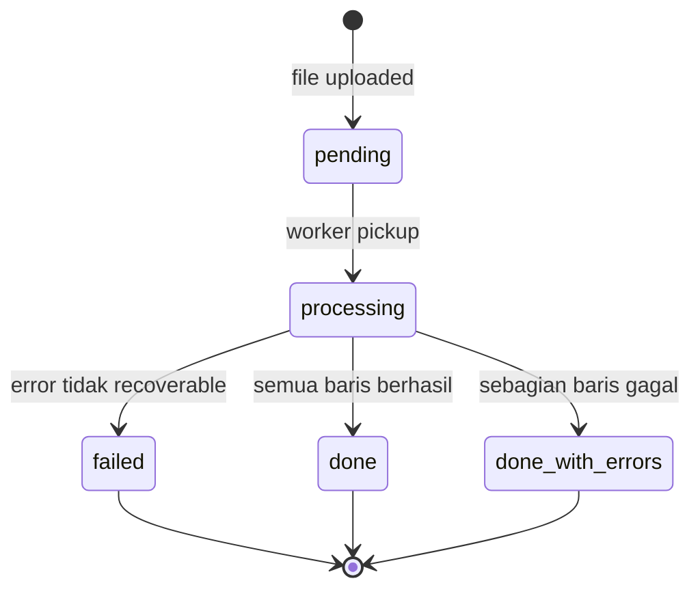

# ERD Eccounting v2

> Konteks: 1 firma konsultan pajak (firm hardcoded) mengelola banyak pembukuan **company** (klien).
> `company_id` adalah **tenant key utama**. Semua data akuntansi di-scope di sini lewat PostgreSQL Row-Level Security.

---

## 1. Diagram top-level (relationship)



---

## 2. Diagram detail kolom

```mermaid
erDiagram
    FIRMS {
        bigserial id PK
        text name
        timestamptz created_at
    }
    USERS {
        bigserial id PK
        bigint firm_id FK
        citext email UK
        text password_hash
        text name
        boolean is_active
        timestamptz created_at
    }
    COMPANIES {
        bigserial id PK
        bigint firm_id FK
        text name
        varchar npwp
        char base_currency
        smallint fiscal_year_start_month
        timestamptz created_at
        timestamptz archived_at
    }
    COMPANY_MEMBERS {
        bigint company_id PK
        bigint user_id PK
        text role "owner|accountant|viewer"
        timestamptz created_at
    }
    ACCOUNTS {
        bigserial id PK
        bigint company_id FK
        bigint parent_id FK
        varchar code "UK (company_id, code)"
        text name
        text category "ASSET|LIABILITY|EQUITY|REVENUE|EXPENSE"
        char normal_balance "D|C"
        boolean is_postable
        smallint level
        ltree path
        timestamptz archived_at
        timestamptz created_at
    }
    ACCOUNTING_PERIODS {
        bigserial id PK
        bigint company_id FK
        smallint year
        smallint month
        text status "open|closed|locked"
        timestamptz closed_at
        bigint closed_by FK
        timestamptz created_at
    }
    JOURNAL_ENTRIES {
        bigserial id PK
        bigint company_id FK
        text posting_number "UK (company_id, posting_number)"
        date posting_date
        date transaction_date
        text description
        text source "manual|cash|import|reversal|adjustment|opening"
        bigint reversal_of_id FK
        bigint import_batch_id FK
        bigint created_by FK
        timestamptz created_at
    }
    JOURNAL_LINES {
        bigserial id PK
        bigint journal_entry_id FK
        bigint company_id "denormalized for RLS perf"
        bigint account_id FK
        smallint line_no
        numeric debit "DECIMAL(20,4) >= 0"
        numeric credit "DECIMAL(20,4) >= 0"
        text reference
        text description
    }
    POSTING_NUMBER_COUNTERS {
        bigint company_id PK
        char yyyymm PK
        text prefix
        int last_value
    }
    ACCOUNT_PERIOD_BALANCE {
        bigint company_id PK
        bigint account_id PK
        smallint year PK
        smallint month PK
        numeric opening
        numeric debit_total
        numeric credit_total
        numeric closing
        timestamptz refreshed_at
    }
    IMPORT_BATCHES {
        bigserial id PK
        bigint company_id FK
        text file_name
        char file_sha256 "UK (company_id, file_sha256)"
        text storage_key
        int total_rows
        int success_rows
        int failed_rows
        text status "pending|processing|done|failed"
        jsonb error_summary
        bigint created_by FK
        timestamptz created_at
        timestamptz finished_at
    }
    AUDIT_LOG {
        bigserial id PK
        bigint firm_id
        bigint company_id
        bigint actor_user_id FK
        text action
        text entity_type
        bigint entity_id
        jsonb old_values
        jsonb new_values
        inet ip_address
        text user_agent
        char prev_hash
        char row_hash
        timestamptz created_at
    }
```



---

## 3. Aturan integritas yang di-enforce di DB

| Aturan | Mekanisme |
|---|---|
| Setiap `journal_entry` harus balanced (Σdebit = Σcredit) | Constraint trigger `DEFERRABLE INITIALLY DEFERRED` |
| Setiap `journal_line`: debit XOR credit (tidak boleh keduanya 0, tidak boleh keduanya isi) | `CHECK ((debit = 0) <> (credit = 0))` |
| Tidak boleh post ke period yang `closed`/`locked` | Trigger `BEFORE INSERT` di `journal_entries` |
| `journal_entries` & `journal_lines` tidak boleh UPDATE/DELETE | Trigger penolak + revoke privilege ke role `app_user` |
| `accounts.code` unique per company | `UNIQUE (company_id, code)` |
| Posting number unique per company | `UNIQUE (company_id, posting_number)` |
| Idempotent import | `UNIQUE (company_id, file_sha256)` di `import_batches` |
| Tenant isolation | RLS policy `company_id = current_setting('app.company_id')::bigint` |
| Audit log tamper-evident | `row_hash = encode(sha256(prev_hash || row_data), 'hex')`, REVOKE UPDATE/DELETE |
| Period balance always reconcilable | Trigger di `journal_lines` insert → marker `account_period_balance.dirty = true` untuk refresh worker |

---

## 4. Sequence diagram — posting jurnal manual



Kunci yang **berbeda dari v1**:
- Semua dalam satu DB transaction.
- Posting number atomic (FOR UPDATE).
- Trigger DB validate period & balanced (tidak bisa di-bypass).
- Balance refresh async (tidak menahan response user).

---

## 5. Sequence diagram — import Excel idempotent



Yang **berbeda dari v1**:
- File hash → idempotent (replay aman).
- Streaming read (file 100MB tidak crash worker).
- Batch per 500 baris, transactional per batch.
- Async dengan progress visibility.
- Tidak ada `temp_journal` shared di DB.

---

## 6. Sequence diagram — tenant context (RLS)



**Keamanan kunci**: kalau ada bug di service yang lupa `WHERE company_id`, **DB tetap menolak data tenant lain**. Berbeda dengan v1 yang 100% bergantung pada session PHP.

---

## 7. State machine — accounting period



---

## 8. State machine — import batch



---

## 9. Penjelasan keputusan desain

### 9.1 Kenapa `journal_lines.company_id` didenormalisasi?

RLS bekerja per tabel. Kalau `journal_lines` hanya bisa di-scope via `JOIN journal_entries`, RLS policy harus `EXISTS` subquery → lambat. Dengan menyimpan `company_id` langsung di `journal_lines`, policy jadi simple `WHERE company_id = current_setting(...)::bigint` → optimizer-friendly + index-friendly.

Konsistensi dijaga lewat trigger:
```sql
-- saat insert journal_lines, isi company_id otomatis dari journal_entries
```

### 9.2 Kenapa pakai `ltree` untuk path COA?

COA hierarchical (1, 1.1, 1.1.1, dst). Query "ambil semua descendant akun X" jadi:
```sql
SELECT * FROM accounts WHERE company_id = ? AND path <@ ?
```
Sangat cepat dengan GiST index. Tidak perlu closure table tambahan seperti v1.

### 9.3 Kenapa `posting_number_counters` tabel sendiri, bukan PostgreSQL `SEQUENCE`?

PostgreSQL SEQUENCE tidak rollback saat transaction failed → akan ada "gap" di nomor jurnal. Untuk akuntansi yang menuntut nomor berurutan tanpa gap (audit), tabel + `FOR UPDATE` lebih cocok.

### 9.4 Kenapa `account_period_balance` di-snapshot, bukan view?

Karena laporan jalan setiap hari, ratusan kali. View = recompute tiap query. Snapshot = upsert sekali saat ada perubahan, dibaca berkali-kali. Untuk akuntansi yang **write << read**, ini optimisasi besar.

Snapshot bisa di-refresh:
1. **Pas posting jurnal**: enqueue job refresh untuk period terdampak (eventual consistent, biasanya <1 detik).
2. **Cron harian**: full refresh untuk validasi (jaga konsistensi vs raw journal).

### 9.5 Kenapa `audit_log` dengan hash chain?

```
row_hash[N] = sha256(row_hash[N-1] || row_data[N])
```

Kalau ada baris di-edit/delete (misal DBA usil), hash chain putus → terdeteksi saat verify. Standar audit yang lebih serius dari sekedar "tabel terpisah".

### 9.6 Kenapa `reversal_of_id` di `journal_entries`?

Append-only design: koreksi = entry baru dengan tanda `reversal_of_id` menunjuk entry lama. Original tetap ada (immutable), pembalik tercatat eksplisit. Audit trail bersih, tidak ada "data hilang misterius".

---

## 10. Daftar file SQL migration

```
migrations/
├── 0001_extensions.sql              -- citext, ltree, pgcrypto
├── 0002_roles.sql                   -- app_user, app_admin role
├── 0003_core_tables.sql             -- firms, users, companies, company_members
├── 0004_accounts_periods.sql        -- accounts (COA dengan ltree), accounting_periods
├── 0005_ledger.sql                  -- journal_entries, journal_lines
├── 0006_ledger_constraints.sql      -- balanced trigger, period trigger, immutability trigger
├── 0007_reporting.sql               -- account_period_balance, posting_number_counters
├── 0008_import_audit.sql            -- import_batches, audit_log (hash chain trigger)
├── 0009_rls.sql                     -- enable RLS + policies di semua tabel tenant
└── 0010_indexes.sql                 -- composite indexes untuk laporan & lookup

seeds/
└── coa_default_indonesia.sql        -- COA standar Indonesia, dipakai saat company baru dibuat
```

Setiap file akan **idempotent** (`IF NOT EXISTS`, `CREATE OR REPLACE`) sehingga aman di-rerun.
