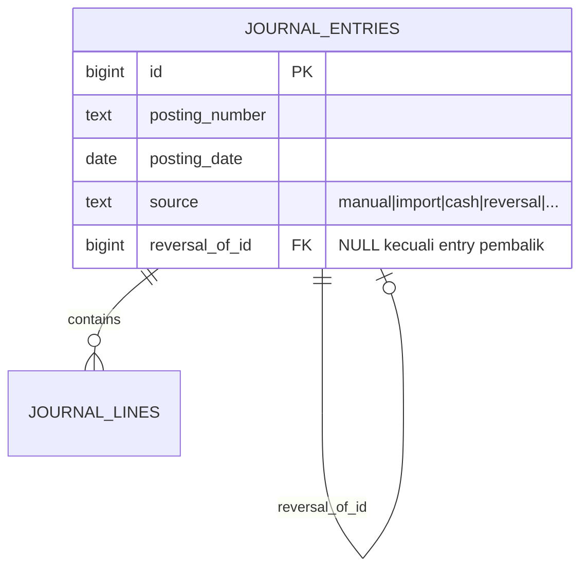
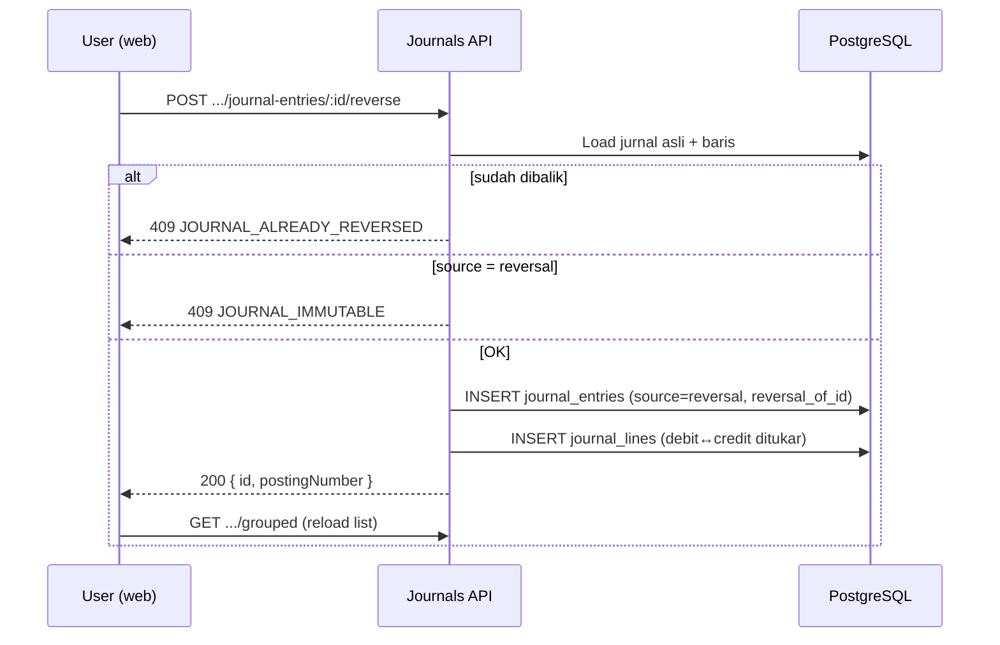

# Pembatalan Jurnal (Reversal) — v2

> Di Eccounting v2, tombol **Hapus** pada daftar jurnal **tidak menghapus data**. Sistem membuat **jurnal pembalik** (reversal entry) sehingga efek netto ke saldo akun kembali nol, sementara audit trail tetap utuh.

---

## 1. Perbandingan v1 vs v2

| Aspek | v1 (Laravel) | v2 (NestJS + PostgreSQL) |
|---|---|---|
| Aksi UI | Tombol hapus → hard delete | Tombol hapus → konfirmasi → reversal |
| Data di DB | `group_journal` + baris `journal` dihapus | `journal_entries` + `journal_lines` **tidak pernah dihapus** |
| Tampilan list | Jurnal hilang dari daftar | Jurnal asli tetap ada + badge **[ DIBATALKAN ]**; muncul jurnal pembalik dengan **[ REVERSAL ]** |
| Efek saldo | Posting dihapus | Debit/kredit ditukar di entry baru → netto nol |
| Audit trail | Data bisa hilang tanpa jejak | Original + pembalik tercatat eksplisit |
| Koreksi lain | Edit/delete bebas | Hanya reversal (atau adjustment entry terpisah) |

### Mengapa tidak hard delete?

Prinsip desain v2 (lihat juga [`AUDIT_REKOMENDASI_V2.md`](./AUDIT_REKOMENDASI_V2.md) §2):

1. **Append-only ledger** — trigger DB menolak `UPDATE`/`DELETE` pada `journal_entries` dan `journal_lines`; privilege `app_user` juga di-revoke.
2. **Audit trail** — tidak ada "data hilang misterius"; setiap koreksi punya pasangan asli ↔ pembalik.
3. **Standar akuntansi** — koreksi posting = entry pembalik, bukan menghapus buku besar.

Di v1, `JournalController::destroy` melakukan hard delete (termasuk loop delete ribuan baris di HTTP request — sumber bug uptime). v2 menggantinya sepenuhnya dengan pola reversal.

---

## 2. Model data



| Field | Arti |
|---|---|
| `source = 'reversal'` | Entry ini adalah jurnal pembalik |
| `reversal_of_id` | Menunjuk `id` jurnal asli yang dibatalkan |
| `isReversed` (computed di API list) | `EXISTS` entry lain dengan `reversal_of_id = id` |
| `isReversal` (computed di API list) | `source === 'reversal'` |

Relasi dan alasan desain: [`ERD.md` §9.6](./ERD.md).

---

## 3. Alur bisnis



### Aturan

1. Satu jurnal asli hanya boleh dibalik **sekali** (`JOURNAL_ALREADY_REVERSED`).
2. Jurnal pembalik (`source = 'reversal'`) **tidak bisa** dibalik lagi (`JOURNAL_IMMUTABLE`).
3. Minimal 2 baris pada jurnal asli (`JOURNAL_INSUFFICIENT_LINES`).
4. `posting_date` pembalik default = hari ini; bisa di-override lewat body request.
5. `posting_number` pembalik di-generate oleh function `next_posting_number(company_id, posting_date)`.

### Isi jurnal pembalik

Untuk setiap baris jurnal asli:

- `debit` ← `credit` asli
- `credit` ← `debit` asli
- `description` ← prefiks `Reversal: ...` (jika ada)
- `account_id`, `reference` — sama dengan asli

Deskripsi header entry: `reason` dari request, atau default `Pembalikan jurnal {posting_number}: {deskripsi asli}`.

---

## 4. API

### Endpoint

```
POST /companies/:companyId/journal-entries/:entryId/reverse
```

**Auth:** Bearer JWT + membership company (`CompanyMemberGuard`).

**Body** (`reverseJournalEntrySchema`):

```json
{
  "reason": "Salah input akun",
  "postingDate": "2026-06-27"
}
```

| Field | Wajib | Keterangan |
|---|---|---|
| `reason` | Ya | 1–500 karakter; jadi deskripsi jurnal pembalik |
| `postingDate` | Tidak | ISO date; default = hari ini |

**Response 200:**

```json
{
  "data": {
    "id": "12345",
    "postingNumber": "2026/06/00042"
  }
}
```

### Error codes

| Code | HTTP | Kondisi |
|---|---|---|
| `JOURNAL_NOT_FOUND` | 404 | `entryId` tidak ada atau bukan milik company |
| `JOURNAL_ALREADY_REVERSED` | 409 | Sudah ada entry dengan `reversal_of_id` menunjuk jurnal ini |
| `JOURNAL_IMMUTABLE` | 409 | Mencoba membalik jurnal pembalik |
| `JOURNAL_INSUFFICIENT_LINES` | 409 | Jurnal asli punya < 2 baris |
| `PERIOD_NOT_OPEN` | 422 | `posting_date` jatuh di periode tertutup (trigger DB) |
| `JOURNAL_UNBALANCED` | 422 | Seharusnya tidak terjadi jika asli valid (trigger deferred) |

### List grouped — flag tambahan

`GET /companies/:companyId/journal-entries/grouped` mengembalikan per baris:

```json
{
  "id": "100",
  "postingNumber": "2026/06/00010",
  "isImported": false,
  "isReversed": true,
  "isReversal": false
}
```

---

## 5. UI (web)

| Lokasi | Perilaku |
|---|---|
| `journal-list-page.tsx` | Tombol merah (Trash) membuka `JournalReverseModal` |
| `journal-reverse-modal.tsx` | Konfirmasi + penjelasan v2 vs v1 |
| Badge **[ DIBATALKAN ]** | Jurnal asli yang sudah punya pembalik |
| Badge **[ REVERSAL ]** | Jurnal pembalik |
| Tombol disabled | Jika `isReversed` atau `isReversal` |

Setelah konfirmasi, UI memanggil endpoint reverse lalu reload mode **Tampil** (grouped).

---

## 6. Migrasi dari v1

- Jurnal v1 yang **soft-deleted** (`deleted_at IS NOT NULL`) tidak di-migrate sebagai hard delete; opsi: skip atau buat reversal terpisah saat cutover.
- Setelah cutover, koreksi hanya lewat reversal di v2 — jangan edit data historis v1.
- Detail ETL: [`MIGRATION_FROM_V1.md`](./MIGRATION_FROM_V1.md) §3–5.

---

## 7. Implementasi (referensi kode)

| Layer | File |
|---|---|
| Schema request | `packages/shared/src/schemas/journal-entry.ts` → `reverseJournalEntrySchema` |
| Error codes | `packages/shared/src/errors/index.ts` → `JOURNAL_NOT_FOUND`, `JOURNAL_ALREADY_REVERSED` |
| List flags | `packages/shared/src/schemas/journal-list.ts` → `isReversed`, `isReversal` |
| Service | `apps/api/src/modules/journals/journals.service.ts` → `reverseEntry()` |
| Controller | `apps/api/src/modules/journals/journals.controller.ts` → `POST :entryId/reverse` |
| UI modal | `apps/web/src/components/journal/journal-reverse-modal.tsx` |
| UI list | `apps/web/src/components/journal/journal-list-page.tsx` |
| DB immutability | `migrations/0006_ledger_constraints.sql` |
| Kolom reversal | `migrations/0005_ledger.sql` |

---

## 8. Testing manual

1. Login, pilih company, buka **Jurnal** → mode **Tampil**.
2. Posting jurnal manual baru (2+ baris, balance).
3. Klik tombol merah pada baris tersebut → **Ya, Batalkan**.
4. Verifikasi:
   - Baris asli: badge **[ DIBATALKAN ]**, tombol hapus disabled.
   - Baris baru: badge **[ REVERSAL ]**, `source` reversal di DB.
   - Neraca saldo / buku besar: saldo netto sama seperti sebelum jurnal asli diposting.
5. Coba batalkan lagi jurnal yang sama → error `JOURNAL_ALREADY_REVERSED`.
6. Coba batalkan jurnal pembalik → error `JOURNAL_IMMUTABLE`.
