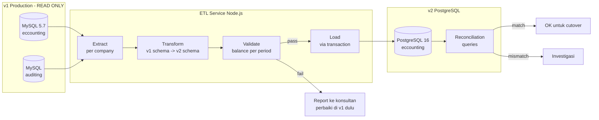
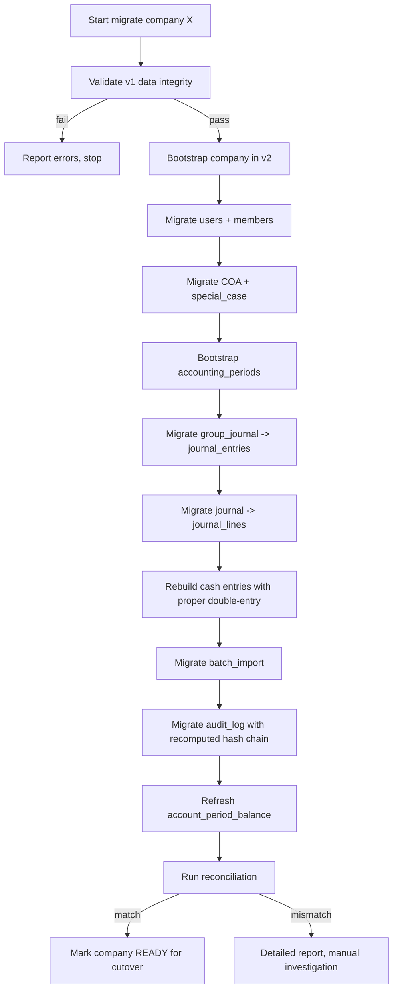
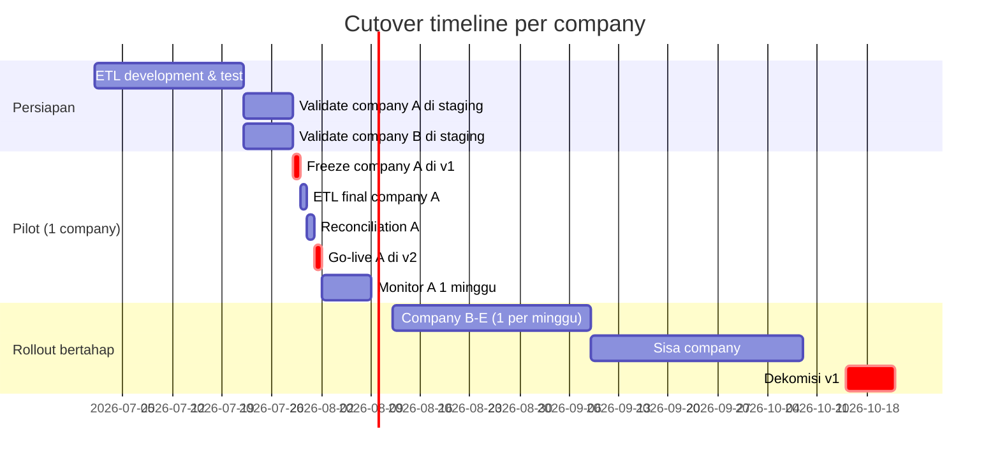

# Migrasi Data v1 (MySQL) → v2 (PostgreSQL)

> Dokumen ini menjelaskan **strategi dan langkah konkret** untuk memindahkan data Eccounting v1 (MySQL 5.7, Laravel 5.5) ke v2 (PostgreSQL 16, NestJS + Next.js) **tanpa kehilangan data dan tetap balance**.

---

## 1. Prinsip migrasi

1. **Migrasi paralel, bukan in-place.** v1 tetap jalan sampai v2 100% siap. Tidak ada momen "downtime besar".
2. **Per-company cutover.** Klien dipindah satu per satu setelah validasi balance match.
3. **Idempotent ETL.** Script harus aman di-rerun. Pakai `ON CONFLICT DO NOTHING` / `UPSERT`.
4. **Reconciliation wajib.** Setiap company di-validasi balance per akun per periode v1 vs v2 **harus identik** sebelum cutover.
5. **Data lama tidak diutak-atik di v1.** Hanya READ. Kalau v2 perlu koreksi, dilakukan di v2 dengan reversal entry, bukan edit data lama.
6. **Audit trail terbentuk dari awal.** Setiap row yang di-migrate masuk juga ke `audit_log` v2 dengan `action='migration.import'`.

---

## 2. Arsitektur ETL

Karena MySQL → PostgreSQL bukan migrasi sepele (tipe data, syntax SQL berbeda), kita pakai approach **ETL Script** terkontrol, bukan pgloader/dump otomatis.



ETL service ditulis di **TypeScript** (Node.js) sebagai script terpisah di monorepo, supaya bisa reuse Drizzle schema v2 untuk type-safety.

```
apps/etl-v1-to-v2/
├── src/
│   ├── extract/        # baca dari MySQL v1 (mysql2 driver)
│   ├── transform/      # mapping per tabel
│   ├── validate/       # balance check, integrity check
│   ├── load/           # insert ke PG v2 lewat Drizzle
│   └── recon/          # reconciliation queries
└── package.json
```

---

## 3. Mapping tabel v1 → v2

### 3.1 Tabel & kolom

| v1 (MySQL) | v2 (PostgreSQL) | Catatan transformasi |
|---|---|---|
| `client.id` | `companies.id` | New BIGSERIAL; simpan mapping `v1_client_id → v2_company_id` di temp table untuk relasi |
| `client.user_id` | `companies.created_by` | Mapping `v1_user_id → v2_user_id` |
| `client.name` | `companies.name` | |
| `client.address` | `companies.address` | |
| `client.phone` | `companies.phone` | |
| `client.email` | `companies.email` | citext |
| (n/a) | `companies.firm_id` | Hardcoded ke firm tunggal (1) |
| (n/a) | `companies.base_currency` | Default `'IDR'` |
| `client.deleted_at` | `companies.archived_at` | |
| `users.*` | `users.*` | + `firm_id = 1` |
| `coa.id` | `accounts.id` | New BIGSERIAL; mapping `v1_coa_id → v2_account_id` |
| `coa.client_id` | `accounts.company_id` | via mapping |
| `coa.parent_id` | `accounts.parent_id` | via mapping (insert parent dulu) |
| `coa.code` | `accounts.code` | |
| `coa.name` | `accounts.name` | |
| `coa.is_debet` | `accounts.normal_balance` | `1` → `'D'`, `0` → `'C'` |
| `coa.is_last` | `accounts.is_postable` | |
| `coa.category_id` | `accounts.category` + `sub_category` | mapping dari `coa_category` table → enum kategori v2 |
| `coa.deleted_at` | `accounts.archived_at` | |
| `coa_special_case` (LABA_RUGI_PERIODE_BERJALAN) | `accounts.is_retained_earning = true` | flag di-set untuk akun terkait |
| `group_journal.id` | `journal_entries.id` | New BIGSERIAL |
| `group_journal.client_id` | `journal_entries.company_id` | |
| `group_journal.id_show` | `journal_entries.posting_number` | tetap sama |
| `group_journal.posting_date` | `journal_entries.posting_date` | |
| (n/a di v1) | `journal_entries.transaction_date` | isi dari `MIN(journal.transaction_date)` per group |
| `group_journal.note` | `journal_entries.description` | |
| `group_journal.batch_import_id` | `journal_entries.import_batch_id` | mapping ke `import_batches.id` baru |
| `group_journal.deleted_at` | (tidak ada di v2, append-only) | Soft-deleted group → **skip**, atau buat reversal entry |
| (sumber: `manual`/`import`/`cash`) | `journal_entries.source` | derive: jika ada batch_import_id → 'import'; jika ada cash reference → 'cash'; else 'manual' |
| `journal.id` | `journal_lines.id` | New BIGSERIAL |
| `journal.group_journal_id` | `journal_lines.journal_entry_id` | via mapping |
| (n/a di v1) | `journal_lines.company_id` | denormalisasi dari `journal_entries.company_id` |
| `journal.coa_id` | `journal_lines.account_id` | via mapping |
| (n/a di v1) | `journal_lines.line_no` | sequence dalam group (ROW_NUMBER OVER PARTITION BY group_journal_id ORDER BY id) |
| `journal.debet` | `journal_lines.debit` | NUMERIC(20,4) |
| `journal.credit` | `journal_lines.credit` | NUMERIC(20,4) |
| `journal.reference` | `journal_lines.reference` | |
| `journal.desc` | `journal_lines.description` | |
| `cash.*` | **REBUILD** sebagai `journal_entries` + 2 lines | ⚠️ data v1 single-side → harus generate offset line (lihat 4.2) |
| `temp_journal.*` | (dihapus) | tidak ada equivalent; staging di client-side v2 |
| `batch_import.*` | `import_batches.*` | + isi `file_sha256` dari recompute file (jika file masih ada) atau random untuk legacy |
| `audits.*` (DB terpisah) | `audit_log.*` | + recompute hash chain |

### 3.2 Konversi tipe data

| MySQL | PostgreSQL |
|---|---|
| `INT UNSIGNED` | `BIGINT` |
| `TINYINT(1)` | `BOOLEAN` |
| `DECIMAL(19,2)` | `NUMERIC(20,4)` (multiply tidak perlu, padding 0 di belakang) |
| `DATETIME` | `TIMESTAMPTZ` (asumsi WIB → konversi ke UTC) |
| `TEXT`, `VARCHAR` | `TEXT`, `VARCHAR(n)` |
| `MEDIUMTEXT` | `TEXT` |
| `JSON` | `JSONB` |

### 3.3 Hal khusus yang harus ditangani

| Situasi | Penanganan |
|---|---|
| `group_journal` dengan `journal` yang **tidak balance** di v1 | **Hentikan migrasi company ini.** Report ke konsultan untuk koreksi di v1. Jangan migrate data buggy. |
| `coa.code` duplikat lintas client di v1 (karena UNIQUE global) | Tidak masalah, di v2 unique-nya `(company_id, code)` |
| `cash` row di v1 yang menghasilkan single-side journal entry | **REBUILD** jadi proper double-entry (lihat 4.2). Lawan akun = "Suspense Account v1 Migration" (akun adjustment) |
| `journal` yang `deleted_at IS NOT NULL` (soft-deleted) | Skip default. Opsi: migrate dengan flag `source='migration_deleted'` di metadata. |
| `group_journal_trash` & `journal_trash` | Skip (data sudah dihapus user). Atau extract ke laporan terpisah jika butuh. |
| Tahun fiskal yang belum ada period di v2 | Auto-create periods (open) lewat `bootstrap_accounting_periods()`. |
| Posting ke periode yang seharusnya sudah closed (audit kemudian baru sadar) | Untuk migrasi: **set semua period status `closed` setelah migrate**, lalu konsultan bisa reopen manual sesuai kebutuhan. |

---

## 4. Algoritma ETL per company



### 4.1 Phase 1 — Validasi sumber v1 sebelum migrasi

Sebelum migrate data dari company tertentu, jalankan **smoke test** di v1:

```sql
-- 1. semua group_journal harus balance
SELECT gj.id, gj.id_show,
       SUM(j.debet) - SUM(j.credit) AS imbalance
  FROM group_journal gj
  JOIN journal j ON j.group_journal_id = gj.id
 WHERE gj.client_id = :v1_client_id
   AND gj.deleted_at IS NULL
 GROUP BY gj.id, gj.id_show
HAVING ABS(SUM(j.debet) - SUM(j.credit)) > 0.01;

-- 2. semua coa.is_last=true harus memiliki valid coa.code
SELECT id, code, name FROM coa
 WHERE client_id = :v1_client_id
   AND is_last = 1
   AND (code IS NULL OR code = '');

-- 3. cek orphan journal (coa_id tidak exist)
SELECT j.id, j.coa_id
  FROM journal j
  JOIN group_journal gj ON gj.id = j.group_journal_id
 LEFT JOIN coa c ON c.id = j.coa_id
 WHERE gj.client_id = :v1_client_id
   AND c.id IS NULL;

-- 4. cek posting date konsisten dengan transaction date
SELECT gj.id, gj.posting_date, MIN(j.transaction_date), MAX(j.transaction_date)
  FROM group_journal gj
  JOIN journal j ON j.group_journal_id = gj.id
 WHERE gj.client_id = :v1_client_id
 GROUP BY gj.id
HAVING MAX(j.transaction_date) > gj.posting_date + INTERVAL 30 DAY;  -- abnormal
```

Kalau ada hasil di query #1 atau #3 → **STOP**. Konsultan harus koreksi di v1 dulu (atau diputuskan untuk migrate dengan adjustment entry di v2).

### 4.2 Phase 2 — Rebuild `cash` single-side jadi proper double-entry

`cash` di v1 menghasilkan `journal` single-side. Di v2 ini melanggar constraint. Strategi rebuild:

```sql
-- Pseudo-SQL: untuk setiap cash entry di v1, buat 2 journal_lines di v2:
-- 1. line asli (debit/credit dari cash.amount terhadap cash.coa_id)
-- 2. line offset terhadap akun "MIGRATION_SUSPENSE" (dibuat khusus per company)

-- Di v2:
-- 1. seed akun suspense:
INSERT INTO accounts (company_id, code, name, category, normal_balance, is_postable)
VALUES (:company_id, 'ZZZZ-V1MIG', 'V1 Migration Adjustment', 'EQUITY', 'C', true);

-- 2. untuk setiap cash entry v1:
--    INSERT journal_entries (source='migration_cash', description='Cash v1 migration #{cash.id}')
--    INSERT journal_lines line 1 (debit jika cash.is_in, credit jika out, ke cash.coa_id)
--    INSERT journal_lines line 2 (offset ke suspense)
```

Konsultan kemudian diberi laporan: "Akun ZZZZ-V1MIG punya saldo X di company Y. Mohon dicocokkan dan dibuat reversal entry yang benar."

### 4.3 Phase 3 — Reconciliation per company

```sql
-- =========================
-- Di v1 (MySQL): saldo per akun di akhir periode P
-- =========================
SELECT c.code, c.name,
       COALESCE(SUM(j.debet),  0) AS total_debet,
       COALESCE(SUM(j.credit), 0) AS total_credit,
       COALESCE(SUM(j.debet),  0) - COALESCE(SUM(j.credit), 0) AS net
  FROM coa c
  LEFT JOIN journal j ON j.coa_id = c.id
  LEFT JOIN group_journal gj ON gj.id = j.group_journal_id
 WHERE c.client_id = :v1_client_id
   AND (gj.posting_date <= :date_finish OR gj.posting_date IS NULL)
   AND (gj.deleted_at IS NULL OR gj.deleted_at IS NULL)
 GROUP BY c.code, c.name
 ORDER BY c.code;

-- =========================
-- Di v2 (PostgreSQL): saldo per akun di akhir periode P
-- =========================
SET LOCAL app.company_id = :v2_company_id;
SELECT a.code, a.name,
       SUM(jl.debit)  AS total_debet,
       SUM(jl.credit) AS total_credit,
       SUM(jl.debit) - SUM(jl.credit) AS net
  FROM accounts a
  LEFT JOIN journal_lines jl ON jl.account_id = a.id
  LEFT JOIN journal_entries je ON je.id = jl.journal_entry_id
 WHERE a.company_id = :v2_company_id
   AND (je.posting_date <= :date_finish OR je.posting_date IS NULL)
 GROUP BY a.code, a.name
 ORDER BY a.code;
```

**Validasi:** total_debet & total_credit setiap akun harus identik antara v1 dan v2 (tolerance 0.01 untuk rounding decimal). Bedakan saja → block cutover.

ETL script jalankan ini otomatis, output CSV diff. Hanya cutover ketika diff kosong.

### 4.4 Phase 4 — Refresh `account_period_balance` snapshot

Setelah semua journal_entries + journal_lines ter-insert:

```sql
-- Untuk setiap (company, account, period) yang ada data:
SELECT refresh_account_period_balance(
    :company_id, account_id, year, month
);
```

Bisa dipanggil batch lewat:

```sql
SELECT refresh_account_period_balance(jl.company_id, jl.account_id,
        EXTRACT(YEAR FROM je.posting_date)::SMALLINT,
        EXTRACT(MONTH FROM je.posting_date)::SMALLINT)
  FROM journal_lines jl
  JOIN journal_entries je ON je.id = jl.journal_entry_id
 WHERE jl.company_id = :company_id
 GROUP BY jl.company_id, jl.account_id,
          EXTRACT(YEAR FROM je.posting_date),
          EXTRACT(MONTH FROM je.posting_date);
```

---

## 5. Strategi cutover per company



Untuk tiap company saat cutover:

1. **T-1 hari**: konsultan diingatkan, freeze fitur di v1 untuk company tsb (banner "Mohon tidak posting di v1 mulai besok").
2. **T-0 pagi**: jalankan ETL final (delta sejak validation terakhir).
3. **T-0 siang**: reconciliation diff harus 0.
4. **T-0 sore**: konsultan login v2, verifikasi laporan neraca akhir bulan terakhir match v1.
5. **T-0 malam**: cutover — v1 untuk company tsb di-mark "migrated", redirect ke v2.
6. **T+1 minggu**: monitor, kalau aman → tidak ada rollback.
7. **T+1 bulan**: data v1 untuk company tsb di-archive read-only.

---

## 6. Daftar query reconciliation siap pakai

Disimpan di repo: `apps/etl-v1-to-v2/recon/*.sql`

| File | Tujuan |
|---|---|
| `recon_account_balance.sql` | Saldo per akun (v1 vs v2) |
| `recon_period_total.sql` | Total debet/credit per periode |
| `recon_journal_count.sql` | Jumlah journal_entries & lines |
| `recon_neraca_match.sql` | Output laporan neraca v1 vs v2 side-by-side |
| `recon_laba_rugi_match.sql` | Output laporan laba rugi v1 vs v2 |
| `recon_orphan_check.sql` | Cek tidak ada line yang FK-nya pecah |

---

## 7. Risiko & mitigasi

| Risiko | Mitigasi |
|---|---|
| Data v1 tidak balance, tapi konsultan tidak sadar | Wajib jalankan query smoke test (4.1) sebelum migrasi. Hasilkan report. |
| Cash v1 generate suspense besar di v2 | Buat akun `ZZZZ-V1MIG`, brief konsultan cara koreksi via reversal entry. |
| Konsultan accidental posting di v1 setelah cutover | Setelah cutover, lakukan `REVOKE INSERT, UPDATE, DELETE` di v1 untuk company tsb. |
| Hash chain audit v1 tidak bisa diverifikasi (v1 tidak punya hash) | Audit v1 di-import as-is dengan `prev_hash = NULL` di row pertama; chain v2 mulai dari sini. Konsultan dijelaskan: audit historis v1 best-effort, audit v2 tamper-evident. |
| Periode lama di-edit setelah migrasi | Set semua period sebelum cutover-date jadi `closed` di v2; reopen manual via UI dengan permission khusus + audit. |
| File Excel batch_import asli sudah tidak ada | `file_sha256` di-isi `'V1-MIGRATED-' || batch.id`, `storage_key` NULL, `status='done'`. Cuma untuk historical reference. |

---

## 8. Checklist untuk konsultan sebelum cutover company X

- [ ] Saldo neraca akhir bulan terakhir match (v1 vs v2)
- [ ] Saldo laba rugi periode terakhir match
- [ ] Total transaksi per akun match (top 20 akun teraktif)
- [ ] Akun `ZZZZ-V1MIG` (suspense) sudah di-review konsultan
- [ ] Laporan buku besar akun kas/bank match di periode 3 bulan terakhir
- [ ] User v2 sudah bisa login & melihat company
- [ ] Konsultan sudah ditraining UI v2 (1 sesi)
- [ ] Konsultan tahu cara revert/koreksi via reversal entry
- [ ] Backup v1 untuk company ini sudah diambil & disimpan
- [ ] Tim support standby selama 24 jam pertama setelah cutover

---

## 9. Estimasi effort

| Item | Estimasi |
|---|---|
| ETL service development | 2–3 minggu |
| Testing ETL di staging dengan data anonim | 1 minggu |
| Validation tools (reconciliation queries + UI diff viewer) | 1 minggu |
| Pilot 1 company | 1 minggu |
| Rollout per company (post-pilot) | 3–5 hari per company |
| Dekomisi v1 | 1 minggu setelah company terakhir |

Untuk firma dengan ~30 klien aktif, total migrasi realistis: **2–3 bulan setelah v2 production-ready**.
